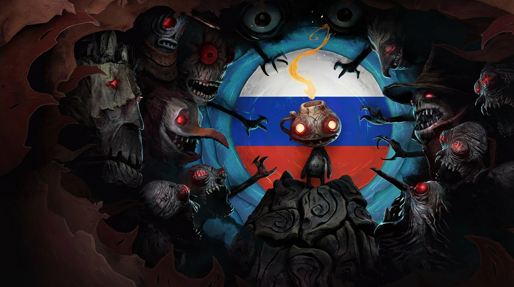
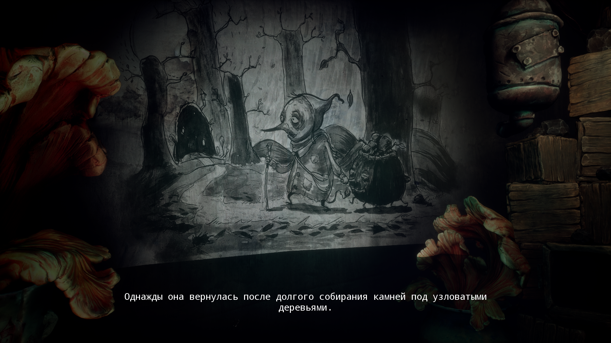
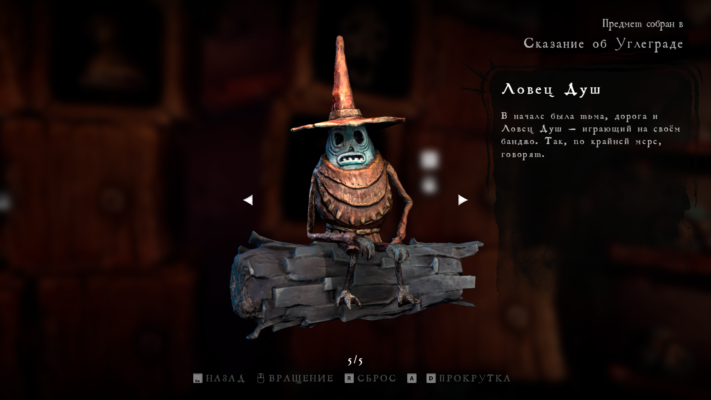

# Русификатор для игры The Midnight Walk 
 
 
[![MIT License](https://img.shields.io/badge/%D0%9B%D0%B8%D1%86%D0%B5%D0%BD%D0%B7%D0%B8%D1%8F%20-%20MIT%20-%203?style=flat&logo=data%3Aimage%2Fsvg%2Bxml%3Bbase64%2CPD94bWwgdmVyc2lvbj0iMS4wIiBlbmNvZGluZz0iaXNvLTg4NTktMSI%2FPg0KPCFET0NUWVBFIHN2ZyBQVUJMSUMgIi0vL1czQy8vRFREIFNWRyAxLjEvL0VOIiAiaHR0cDovL3d3dy53My5vcmcvR3JhcGhpY3MvU1ZHLzEuMS9EVEQvc3ZnMTEuZHRkIj4NCjxzdmcgZmlsbD0iI0ZGRkZGRiIgaGVpZ2h0PSI4MDBweCIgd2lkdGg9IjgwMHB4IiB2ZXJzaW9uPSIxLjEiIGlkPSJDYXBhXzEiIHhtbG5zPSJodHRwOi8vd3d3LnczLm9yZy8yMDAwL3N2ZyIgeG1sbnM6eGxpbms9Imh0dHA6Ly93d3cudzMub3JnLzE5OTkveGxpbmsiIA0KCSB2aWV3Qm94PSIwIDAgMjI0LjcyNiAyMjQuNzI2IiB4bWw6c3BhY2U9InByZXNlcnZlIj4NCjxwYXRoIGQ9Ik0yMjMuNjEyLDEwOS41ODZMMTkwLjUsMzUuNzUyYy0wLjAwMS0wLjAwMi0wLjAwMi0wLjAwNC0wLjAwMy0wLjAwNmwtMC4wNDMtMC4wOTZjLTAuMTExLTAuMjQ3LTAuMjQzLTAuNDc5LTAuMzg5LTAuNw0KCWMtMC4wMzktMC4wNi0wLjA4Ni0wLjExNC0wLjEyNy0wLjE3MWMtMC4xMzEtMC4xODItMC4yNzItMC4zNTMtMC40MjQtMC41MTRjLTAuMDYtMC4wNjMtMC4xMjEtMC4xMjUtMC4xODQtMC4xODUNCgljLTAuMTY4LTAuMTU5LTAuMzQ1LTAuMzA2LTAuNTMzLTAuNDRjLTAuMDQ5LTAuMDM2LTAuMDk0LTAuMDc2LTAuMTQ1LTAuMTFjLTAuMjM2LTAuMTU2LTAuNDg2LTAuMjktMC43NDYtMC40MDUNCgljLTAuMDc0LTAuMDMzLTAuMTUxLTAuMDU3LTAuMjI3LTAuMDg2Yy0wLjIwNC0wLjA3OC0wLjQxMS0wLjE0My0wLjYyNS0wLjE5NGMtMC4wODgtMC4wMjEtMC4xNzUtMC4wNDItMC4yNjQtMC4wNTgNCgljLTAuMjkzLTAuMDU0LTAuNTkxLTAuMDktMC44OTYtMC4wOWgtNTguNDI4Yy0xLTMuMTExLTIuOTQzLTUuNzk0LTUuNDg1LTcuNzM3di03LjI2MmMwLTIuNzYxLTIuMjM5LTUtNS01aC05LjMzNA0KCWMtMi43NjEsMC01LDIuMjM5LTUsNXY3LjM4MWMtMi40NjUsMS45MzMtNC4zNDcsNC41NzItNS4zMjYsNy42MTlIMzguNzM0Yy0wLjMwNSwwLTAuNjAyLDAuMDM3LTAuODk2LDAuMDkNCgljLTAuMDksMC4wMTYtMC4xNzYsMC4wMzctMC4yNjQsMC4wNThjLTAuMjE0LDAuMDUxLTAuNDIyLDAuMTE2LTAuNjI1LDAuMTk0Yy0wLjA3NiwwLjAyOS0wLjE1MywwLjA1My0wLjIyNywwLjA4Ng0KCWMtMC4yNiwwLjExNS0wLjUxLDAuMjQ4LTAuNzQ2LDAuNDA1Yy0wLjA1MSwwLjAzNC0wLjA5NiwwLjA3NC0wLjE0NSwwLjExYy0wLjE4OCwwLjEzNC0wLjM2NSwwLjI4LTAuNTMzLDAuNDQNCgljLTAuMDY0LDAuMDYtMC4xMjQsMC4xMjItMC4xODUsMC4xODVjLTAuMTUzLDAuMTYxLTAuMjkzLDAuMzMzLTAuNDI0LDAuNTE0Yy0wLjA0MiwwLjA1OC0wLjA4OCwwLjExMi0wLjEyNywwLjE3MQ0KCWMtMC4xNDYsMC4yMjEtMC4yNzgsMC40NTMtMC4zODksMC43bC0wLjA0MywwLjA5NmMtMC4wMDEsMC4wMDItMC4wMDIsMC4wMDQtMC4wMDMsMC4wMDZMMC44OTcsMTA5Ljg0OA0KCUMwLjMzNSwxMTAuNjU3LDAsMTExLjYzNiwwLDExMi42OTZjMCwyMS4zNTgsMTcuMzc2LDM4LjczNCwzOC43MzQsMzguNzM0YzIxLjM1OCwwLDM4LjczNC0xNy4zNzYsMzguNzM0LTM4LjczNA0KCWMwLTEuMDYtMC4zMzQtMi4wMzgtMC44OTctMi44NDdMNDYuNDU2LDQyLjY5Nmg1MC45ODZjMS4wMDcsMi45MDUsMi44MzEsNS40MjQsNS4yMDQsNy4yODZ2MTI1LjM4MUg1OC4zMDgNCgljLTEuODcxLDAtMy41ODYsMS4wNDUtNC40NDQsMi43MDhMNDAuMTEsMjA0LjczOGMtMC43OTksMS41NS0wLjczMywzLjQwNSwwLjE3NCw0Ljg5NGMwLjkwOCwxLjQ4OSwyLjUyNSwyLjM5OCw0LjI3LDIuMzk4aDEzNS41MTkNCgljMC4wMDYtMC4wMDEsMC4wMTIsMCwwLjAyLDBjMi43NjEsMCw1LTIuMjM5LDUtNWMwLTAuOTgtMC4yODItMS44OTQtMC43NjktMi42NjVsLTEzLjU2My0yNi4yOTQNCgljLTAuODU4LTEuNjYzLTIuNTczLTIuNzA4LTQuNDQ0LTIuNzA4SDEyMS45OFY1MC4xMDFjMi40NDktMS44NzMsNC4zMzQtNC40MzYsNS4zNjMtNy40MDVoNTAuODI4bC0zMC40NzUsNjcuOTU0DQoJYy0wLjAwOCwwLjAxOC0wLjAxMiwwLjAzNi0wLjAyLDAuMDU0Yy0wLjAyMywwLjA1NC0wLjA0LDAuMTEtMC4wNjIsMC4xNjVjLTAuMDksMC4yMjktMC4xNjIsMC40NjMtMC4yMTcsMC42OTkNCgljLTAuMDE0LDAuMDYyLTAuMDMyLDAuMTIyLTAuMDQ0LDAuMTg0Yy0wLjA1NSwwLjI4Ny0wLjA4MywwLjU3Ni0wLjA4NywwLjg2NmMwLDAuMDI3LTAuMDA4LDAuMDUxLTAuMDA4LDAuMDc4DQoJYzAsMjEuMzU4LDE3LjM3NiwzOC43MzQsMzguNzM0LDM4LjczNHMzOC43MzQtMTcuMzc2LDM4LjczNC0zOC43MzRDMjI0LjcyNiwxMTEuNTE0LDIyNC4yOTgsMTEwLjQ0MiwyMjMuNjEyLDEwOS41ODZ6DQoJIE02NC42NDYsMTA3LjY5NkgxMi44MjJsMjUuOTEyLTU3Ljc4MUw2NC42NDYsMTA3LjY5NnogTTExOC4yMjYsMzcuNTNjMCwzLjIxNy0yLjYxNyw1LjgzMy01LjgzMyw1LjgzMw0KCWMtMy4yMTcsMC01LjgzNC0yLjYxNy01LjgzNC01LjgzM2MwLTMuMjE3LDIuNjE3LTUuODMzLDUuODM0LTUuODMzQzExNS42MDksMzEuNjk2LDExOC4yMjYsMzQuMzEzLDExOC4yMjYsMzcuNTN6IE0xNTkuOTgsMTA3LjY5Ng0KCWwyNS45MTMtNTcuNzgxbDI1LjkxMiw1Ny43ODFIMTU5Ljk4eiIvPg0KPC9zdmc%2B&labelColor=gray&color=1B6B60
)](https://github.com/Dontaz/TheMidnightWalk-RU/blob/main/LICENSE) 
 

## Содержание

1. **[Описание](https://github.com/Dontaz/TheMidnightWalk-RU?tab=readme-ov-file#%D0%BE%D0%BF%D0%B8%D1%81%D0%B0%D0%BD%D0%B8%D0%B5)**
2. **[Ссылки](https://github.com/Dontaz/TheMidnightWalk-RU?tab=readme-ov-file#%D1%81%D1%81%D1%8B%D0%BB%D0%BA%D0%B8)**
    1. **[Страницы русификатора в Steam](https://github.com/Dontaz/TheMidnightWalk-RU?tab=readme-ov-file#%D1%81%D1%82%D1%80%D0%B0%D0%BD%D0%B8%D1%86%D1%8B-%D1%80%D1%83%D1%81%D0%B8%D1%84%D0%B8%D0%BA%D0%B0%D1%82%D0%BE%D1%80%D0%B0-%D0%B2-steam)**
    2. **[Скачивание со сторонних ресурсов](https://github.com/Dontaz/TheMidnightWalk-RU?tab=readme-ov-file#%D1%81%D0%BA%D0%B0%D1%87%D0%B8%D0%B2%D0%B0%D0%BD%D0%B8%D0%B5-%D1%81%D0%BE-%D1%81%D1%82%D0%BE%D1%80%D0%BE%D0%BD%D0%BD%D0%B8%D1%85-%D1%80%D0%B5%D1%81%D1%83%D1%80%D1%81%D0%BE%D0%B2)**
3. **[Инструкция к установке через автоматический установщик](https://github.com/Dontaz/TheMidnightWalk-RU?tab=readme-ov-file#%D0%B8%D0%BD%D1%81%D1%82%D1%80%D1%83%D0%BA%D1%86%D0%B8%D1%8F-%D0%BA-%D1%83%D1%81%D1%82%D0%B0%D0%BD%D0%BE%D0%B2%D0%BA%D0%B5-%D1%87%D0%B5%D1%80%D0%B5%D0%B7-%D0%B0%D0%B2%D1%82%D0%BE%D0%BC%D0%B0%D1%82%D0%B8%D1%87%D0%B5%D1%81%D0%BA%D0%B8%D0%B9-%D1%83%D1%81%D1%82%D0%B0%D0%BD%D0%BE%D0%B2%D1%89%D0%B8%D0%BA)**
4. **[Инструкция к установке вручную из архива](https://github.com/Dontaz/TheMidnightWalk-RU?tab=readme-ov-file#%D0%B8%D0%BD%D1%81%D1%82%D1%80%D1%83%D0%BA%D1%86%D0%B8%D1%8F-%D0%BA-%D1%83%D1%81%D1%82%D0%B0%D0%BD%D0%BE%D0%B2%D0%BA%D0%B5-%D0%B2%D1%80%D1%83%D1%87%D0%BD%D1%83%D1%8E-%D0%B8%D0%B7-%D0%B0%D1%80%D1%85%D0%B8%D0%B2%D0%B0)**
5. **[Инструкция к установке на Steam Deck](https://github.com/Dontaz/TheMidnightWalk-RU?tab=readme-ov-file#%D0%B8%D0%BD%D1%81%D1%82%D1%80%D1%83%D0%BA%D1%86%D0%B8%D1%8F-%D0%BA-%D1%83%D1%81%D1%82%D0%B0%D0%BD%D0%BE%D0%B2%D0%BA%D0%B5-%D0%BD%D0%B0-steam-deck)**
6. **[Инструкция к обновлению или замене перевода](https://github.com/Dontaz/TheMidnightWalk-RU?tab=readme-ov-file#%D0%B8%D0%BD%D1%81%D1%82%D1%80%D1%83%D0%BA%D1%86%D0%B8%D1%8F-%D0%BA-%D0%BE%D0%B1%D0%BD%D0%BE%D0%B2%D0%BB%D0%B5%D0%BD%D0%B8%D1%8E-%D0%B8%D0%BB%D0%B8-%D0%B7%D0%B0%D0%BC%D0%B5%D0%BD%D0%B5-%D0%BF%D0%B5%D1%80%D0%B5%D0%B2%D0%BE%D0%B4%D0%B0)**
7. **[Инструкция по удалению перевода](https://github.com/Dontaz/TheMidnightWalk-RU?tab=readme-ov-file#%D0%B8%D0%BD%D1%81%D1%82%D1%80%D1%83%D0%BA%D1%86%D0%B8%D1%8F-%D0%BF%D0%BE-%D1%83%D0%B4%D0%B0%D0%BB%D0%B5%D0%BD%D0%B8%D1%8E-%D0%BF%D0%B5%D1%80%D0%B5%D0%B2%D0%BE%D0%B4%D0%B0)**
8. **[Пример перевода (Скриншоты)](https://github.com/Dontaz/TheMidnightWalk-RU?tab=readme-ov-file#%D0%BF%D1%80%D0%B8%D0%BC%D0%B5%D1%80-%D0%BF%D0%B5%D1%80%D0%B5%D0%B2%D0%BE%D0%B4%D0%B0-%D1%81%D0%BA%D1%80%D0%B8%D0%BD%D1%88%D0%BE%D1%82%D1%8B)**
9. **[Дисклеймер](https://github.com/Dontaz/TheMidnightWalk-RU?tab=readme-ov-file#%D0%B4%D0%B8%D1%81%D0%BA%D0%BB%D0%B5%D0%B9%D0%BC%D0%B5%D1%80)**

---

## Описание

Перевёл Dontaz. Полностью готовый ручной перевод на русский язык с вычиткой и редактурой. Сохранены смыслы игры слов, некоторые шутки и нарицательные имена. В меру своих сил литературно иносказал некоторые слова (там, где это подразумевается самой игрой).

---

## Ссылки

### Страницы русификатора в Steam

- [Страница русификатора в Steam Guides (руководствах Steam)](https://steamcommunity.com/sharedfiles/filedetails/?id=3480297954)
- [Страница обсуждения русификатора в Steam Discussions](https://steamcommunity.com/app/2863640/discussions/0/596277279406979971/)

### Скачивание со сторонних ресурсов

- **Автоматический установщик:**
  - [Ссылка на скачивание с Яндекс Диска](https://disk.yandex.ru/d/J4EwEZ5ByxWDAQ)
  - [Ссылка на скачивание с Google Drive](https://drive.google.com/file/d/1fZdoeMvyBcMiQ4_iYgu4d3ja_JtkiU9V/view)
  - [Ссылка на скачивание с PlayGround](https://www.playground.ru/midnight_walk/file/the_midnight_walk_rusifikator_teksta_v2_3_20250703_dontaz-1770014)
  - [Ссылка на скачивание с Zone of Games](https://www.zoneofgames.ru/games/midnight_walk_the/files/10124.html)
- **Архив для установки вручную:**
  - [Ссылка на скачивание с Яндекс Диска](https://disk.yandex.ru/d/OmadX8Tt7EnMZA)
  - [Ссылка на скачивание с Google Drive](https://drive.google.com/file/d/1rRnrQlqRlV2D8ls2QPruRPfODQC-_Yok/view)
  - [Ссылка на скачивание с PlayGround](https://www.playground.ru/midnight_walk/file/the_midnight_walk_rusifikator_teksta_v2_3_20250703_dontaz-1770014)
  - [Ссылка на скачивание с Nexus Mods](https://www.nexusmods.com/themidnightwalk/mods/8?tab=description)

---

## Инструкция к установке через автоматический установщик

- Скачиваете файл:
  - либо по ссылкам из секции «[Скачивание со сторонних ресурсов](https://github.com/Dontaz/themidnightwalk-ru?tab=readme-ov-file#%D1%81%D0%BA%D0%B0%D1%87%D0%B8%D0%B2%D0%B0%D0%BD%D0%B8%D0%B5-%D1%81%D0%BE-%D1%81%D1%82%D0%BE%D1%80%D0%BE%D0%BD%D0%BD%D0%B8%D1%85-%D1%80%D0%B5%D1%81%D1%83%D1%80%D1%81%D0%BE%D0%B2) → Автоматический установщик» с желаемого источника,
  - либо с [GitHub в Releases](https://github.com/Dontaz/themidnightwalk-ru/releases) файл «The.Midnight.Walk.RU.exe»;
- Запускаете .exe файл;
- Снизу окна программы нажмите «Далее»;
- Если установщик неправильно указал путь к вашей игре — нажмите «Обзор» справа от строки с путём к игре и укажите путь к вашей игре;
- После того, как в строке будет указан правильный путь к вашей игре, нажмите снизу «Далее»;
- Нажмите снизу окна «Установить»;
- Русификатор установлен, можете нажать кнопку «Завершить» снизу окна.

---

## Инструкция к установке вручную из архива
- Скачиваете архив:
  - либо по ссылке из секции «[Скачивание со сторонних ресурсов](https://github.com/Dontaz/themidnightwalk-ru?tab=readme-ov-file#%D1%81%D0%BA%D0%B0%D1%87%D0%B8%D0%B2%D0%B0%D0%BD%D0%B8%D0%B5-%D1%81%D0%BE-%D1%81%D1%82%D0%BE%D1%80%D0%BE%D0%BD%D0%BD%D0%B8%D1%85-%D1%80%D0%B5%D1%81%D1%83%D1%80%D1%81%D0%BE%D0%B2) → Архив для установки вручную» с желаемого источника,
  - либо с [GitHub в Releases](https://github.com/Dontaz/themidnightwalk-ru/releases) файл «The.Midnight.Walk.RU.zip»;
- Переносите папку «TheMidnightWalk» из архива в папку с игрой по пути «...\steamapps\common\The Midnight Walk».

---

## Инструкция к установке на Steam Deck

- Переходите в режим Рабочего стола через длительное удержание кнопки выключения → «Перейти в режим рабочего стола», либо через меню Steam (кнопка STEAM) → «Выключение» → «Перейти в режим рабочего стола»;
- Скачиваете автоматический установщик (файл «The.Midnight.Walk.RU.exe»), либо архив (файл «The.Midnight.Walk.RU.zip» из [GitHub в Releases](https://github.com/Dontaz/themidnightwalk-ru/releases) или по ссылкам из секции [Скачивание со сторонних ресурсов](https://github.com/Dontaz/TheMidnightWalk-RU?tab=readme-ov-file#%D1%81%D0%BA%D0%B0%D1%87%D0%B8%D0%B2%D0%B0%D0%BD%D0%B8%D0%B5-%D1%81%D0%BE-%D1%81%D1%82%D0%BE%D1%80%D0%BE%D0%BD%D0%BD%D0%B8%D1%85-%D1%80%D0%B5%D1%81%D1%83%D1%80%D1%81%D0%BE%D0%B2);
- **Если ставите вручную из архива:**
    - Переносите папку «TheMidnightWalk» из архива в папку с игрой по пути «/home/deck/.local/share/Steam/steamapps/common/The Midnight Walk».
- **Если ставите через автоматический установщик:**
    - Правый клик (либо LT — левый триггер) по .exe файлу и выберите «Add to Steam»;
    - Перейдите в Steam (не выходя из режима рабочего стола);
    - Найдите в библиотеке установщик русификатора и кликните по нему правым кликом (либо LT — левый триггер);
    - Выберите «Свойства...» и перейдите в раздел «Совместимость»;
    - Поставьте галочку перед «Принудительно использовать выбранный инструмент совместимости Steam Play»;
    - Ниже появится список, из которого нужно выбрать желаемую версию Proton, рекомендую «Proton 9.0-4», был проведён тест и на этой версии установщик запускается без каких-либо проблем;
    - _Если у вас перестал работать TouchPad во время установки → Используйте TouchPad с зажатой кнопкой «STEAM»;_
    - Снизу окна программы нажмите «Далее»;
    - Установщик имеет встроенный поиск пути к игре на Steam Deck, но если всё же установщик неправильно указал путь к вашей игре — нажмите «Обзор» справа от строки с путём к игре и укажите путь к вашей игре;
    - После того, как в строке будет указан правильный путь к вашей игре, нажмите снизу «Далее»;
    - Нажмите снизу окна «Установить»;
    - Русификатор установлен, можете нажать кнопку «Завершить» снизу окна.

---

## Инструкция к обновлению или замене перевода

- **Если у вас мой перевод и вы хотите его обновить:**
  - Если устанавливаете новую версию с помощью автоматического установщика:
    - Скачиваете автоматический установщик с новой версией по ссылкам из секции «[Скачивание со сторонних ресурсов](https://github.com/Dontaz/themidnightwalk-ru?tab=readme-ov-file#%D1%81%D0%BA%D0%B0%D1%87%D0%B8%D0%B2%D0%B0%D0%BD%D0%B8%D0%B5-%D1%81%D0%BE-%D1%81%D1%82%D0%BE%D1%80%D0%BE%D0%BD%D0%BD%D0%B8%D1%85-%D1%80%D0%B5%D1%81%D1%83%D1%80%D1%81%D0%BE%D0%B2) → Автоматический установщик» с желаемого источника, либо с [GitHub в Releases](https://github.com/Dontaz/themidnightwalk-ru/releases) файл «The.Midnight.Walk.RU.exe»;
    - Выполняете по пунктам инструкцию по установке через автоматический установщик (секция «[Инструкция к установке через автоматический установщик](https://github.com/Dontaz/themidnightwalk-ru?tab=readme-ov-file#%D0%B8%D0%BD%D1%81%D1%82%D1%80%D1%83%D0%BA%D1%86%D0%B8%D1%8F-%D0%BA-%D1%83%D1%81%D1%82%D0%B0%D0%BD%D0%BE%D0%B2%D0%BA%D0%B5-%D1%87%D0%B5%D1%80%D0%B5%D0%B7-%D0%B0%D0%B2%D1%82%D0%BE%D0%BC%D0%B0%D1%82%D0%B8%D1%87%D0%B5%D1%81%D0%BA%D0%B8%D0%B9-%D1%83%D1%81%D1%82%D0%B0%D0%BD%D0%BE%D0%B2%D1%89%D0%B8%D0%BA)»);
    - Автоматический установщик сам заменит старую версию новой.
  - Если устанавливаете новую версию вручную из архива:
    - Скачиваете архив для установки вручную с новой версией либо по ссылкам из секции «[Скачивание со сторонних ресурсов](https://github.com/Dontaz/themidnightwalk-ru?tab=readme-ov-file#%D1%81%D0%BA%D0%B0%D1%87%D0%B8%D0%B2%D0%B0%D0%BD%D0%B8%D0%B5-%D1%81%D0%BE-%D1%81%D1%82%D0%BE%D1%80%D0%BE%D0%BD%D0%BD%D0%B8%D1%85-%D1%80%D0%B5%D1%81%D1%83%D1%80%D1%81%D0%BE%D0%B2) → Архив для установки вручную», либо с [GitHub в Releases](https://github.com/Dontaz/themidnightwalk-ru/releases) файл «The.Midnight.Walk.RU.zip»;
    - Перенесите папку «TheMidnightWalk» из архива в папку с игрой по пути «...\steamapps\common\The Midnight Walk»;
    - Выполните копирование с заменой новым файлом.
- **Если вы хотите заменить русификатор от другого переводчика моим переводом:**
  - Если у вас стоит машинный перевод от Chillstream, то автоматический установщик моего перевода имеет встроенное удаление этого перевода при его нахождении в папке с игрой (ничего дополнительно нажимать не нужно, функция автоматическая и происходит во время установки).
  - Если у вас перевод от других переводчиков:
    - Выполнить удаление другого перевода по инструкции переводчика этого перевода или ↓
    - Перейти в папку «Paks» по пути «\steamapps\common\The Midnight Walk\TheMidnightWalk\Content\» и удалить оттуда все файлы и папки КРОМЕ файла «TheMidnightWalk-Windows.pak» (который весит около 16.5 ГБ);
    - Выбрать желаемый способ установки моего перевода (через автоматический установщик или вручную архивом) и следовать инструкции этого способа.
- **Если вы хотите заменить мой русификатор (перевод) другим от других переводчиков:**
  - Удалить мой перевод по инструкции из секции «[Инструкция по удалению перевода](https://github.com/Dontaz/themidnightwalk-ru?tab=readme-ov-file#%D0%B8%D0%BD%D1%81%D1%82%D1%80%D1%83%D0%BA%D1%86%D0%B8%D1%8F-%D0%BF%D0%BE-%D1%83%D0%B4%D0%B0%D0%BB%D0%B5%D0%BD%D0%B8%D1%8E-%D0%BF%D0%B5%D1%80%D0%B5%D0%B2%D0%BE%D0%B4%D0%B0)» (1 и 2 пункты);
  - Установить перевод от других переводчиков по их инструкции.

---

## Инструкция по удалению перевода

- **У вас мой перевод, который вы установили ручным способом через архив:**
  - Перейти в папку «Paks» по пути «\steamapps\common\The Midnight Walk\TheMidnightWalk\Content\» и удалить оттуда файл «RussianLanguage_P.pak»

- **У вас мой перевод, который вы установили через автоматический установщик:**
  - Перейти в папку «Удаление русификатора», которая находится в корневой папке с игрой «\steamapps\common\The Midnight Walk\» и запустить файл «unins000.exe»

- **У вас установлен русификатор от других переводчиков:**
  - Перейти в папку «Paks» по пути «\steamapps\common\The Midnight Walk\TheMidnightWalk\Content\» и удалить оттуда все файлы и папки КРОМЕ файла «TheMidnightWalk-Windows.pak» (который весит ~16.5 ГБ) или ↓
  - Выполнить удаление другого перевода по инструкции переводчика этого перевода.

---

## Пример перевода (Скриншоты)

---

## Дисклеймер

Данный перевод является неофициальным и фанатским. Он создан исключительно в ознакомительных целях и распространяется бесплатно. Я не преследую коммерческих целей. Все права на игру принадлежат её компании-разработчику и издателю. Если вам понравилась игра, пожалуйста, поддержите разработчиков покупкой лицензионной копии. Установка, использование и/или модификация файлов осуществляется пользователем добровольно, по собственной инициативе и под его личную ответственность. Автор перевода не несёт ответственности за возможные последствия, в том числе технические неполадки, некорректную работу программы или утрату данных. Используя данный материал, вы подтверждаете, что принимаете на себя все риски.